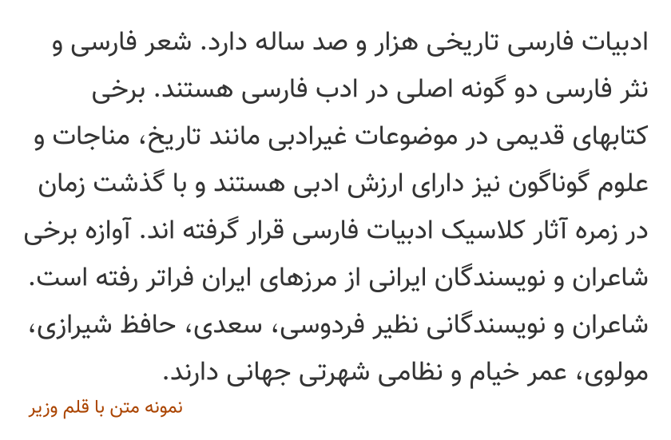

# Vazir-Font-Farsi-number

A Persian (Farsi) Font

## نمونه متن Sample:


## طریقه استفاده در صفحات وب:

<p dir="rtl">
کد زیر را در قسمت style یا فایل css وارد نمایید:
</p>


```css
@font-face {
  font-family: Vazir;
  src: url('Vazir-FD.eot');
  src: url('Vazir-FD.eot?#iefix') format('embedded-opentype'),
       url('Vazir-FD.woff2') format('woff2'),
       url('Vazir-FD.woff') format('woff'),
       url('Vazir-FD.ttf') format('truetype');
  font-weight: normal;
}

@font-face {
  font-family: Vazir;
  src: url('Vazir-Bold-FD.eot');
  src: url('Vazir-Bold-FD.eot?#iefix') format('embedded-opentype'),
       url('Vazir-Bold-FD.woff2') format('woff2'),
       url('Vazir-Bold-FD.woff') format('woff'),
       url('Vazir-Bold-FD.ttf') format('truetype');
  font-weight: bold;
}

@font-face {
  font-family: Vazir;
  src: url('Vazir-Light-FD.eot');
  src: url('Vazir-Light-FD.eot?#iefix') format('embedded-opentype'),
       url('Vazir-Light-FD.woff2') format('woff2'),
       url('Vazir-Light-FD.woff') format('woff'),
       url('Vazir-Light-FD.ttf') format('truetype');
  font-weight: 300;
}

@font-face {
  font-family: Vazir;
  src: url('Vazir-Medium-FD.eot');
  src: url('Vazir-Medium-FD.eot?#iefix') format('embedded-opentype'),
       url('Vazir-Medium-FD.woff2') format('woff2'),
       url('Vazir-Medium-FD.woff') format('woff'),
       url('Vazir-Medium-FD.ttf') format('truetype');
  font-weight: 500;
}

@font-face {
  font-family: Vazir;
  src: url('Vazir-Thin-FD.eot');
  src: url('Vazir-Thin-FD.eot?#iefix') format('embedded-opentype'),
       url('Vazir-Thin-FD.woff2') format('woff2'),
       url('Vazir-Thin-FD.woff') format('woff'),
       url('Vazir-Thin-FD.ttf') format('truetype');
  font-weight: 100;
}

@font-face {
  font-family: Vazir;
  src: url('Vazir-Black-FD.eot');
  src: url('Vazir-Black-FD.eot?#iefix') format('embedded-opentype'),
       url('Vazir-Black-FD.woff2') format('woff2'),
       url('Vazir-Black-FD.woff') format('woff'),
       url('Vazir-Black-FD.ttf') format('truetype');
  font-weight: 900;
}
```
#### npm
```
npm i vazir-font-farsi-number
```
Fonts will be copied to `node_modules/vazir-font/dist` directory

```
font-family: 'Vazir', sans-serif;
```
